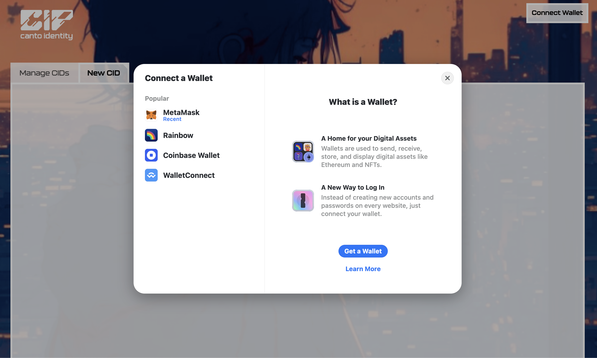
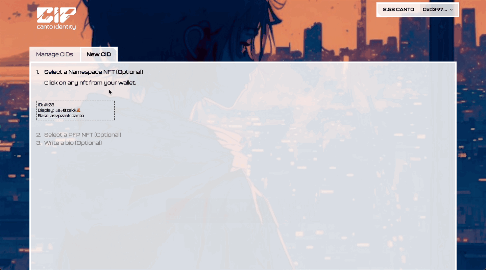
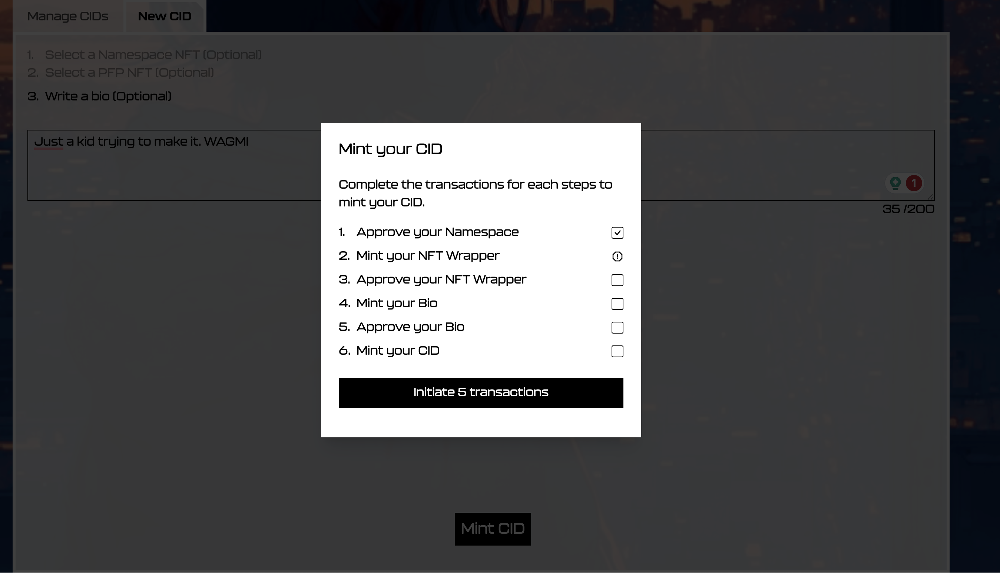
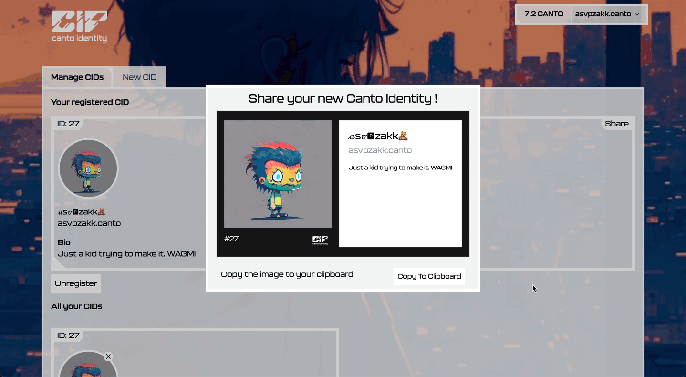

# Canto Identity Registration Guide

Welcome to the Canto Identity registration guide. This guide will walk you through the process of registering your Canto Identity (CID), a new protocol system designed to bring a broader, more meaningful interpretation to onchain self-expression.

## Understanding Canto Identity: CID

To create the most authentic reflection of onchain identity, a user would attach multiple subprotocol NFTs to their CID, to paint a more vivid picture of who they are. It is important to note that a wallet can only have one CID registered to its address at any given time.

At launch, CIP will have three subprotocol identity trait NFTs for users to attach to their CID:
- Canto Namespace
- PFP
- BIO

## Registering Your CID

To register a CID, users will need to:
1. Create a Canto Name
2. Have a Canto ERC721 NFT in their wallet
3. Write a bio to display to the community

Once you have all those prepared, follow the instructions below to register your CID.

### Step-by-Step Instructions

**Step 1: Connecting your Wallet**
- Click on "Connect Wallet" in the top right-hand corner of the interface.
- If this is your first time connecting to Canto Identity, choose your preferred wallet option.

**Step 2: New CID**
- Once your wallet is connected, select “New CID” to start the registration process.
- Select your Canto Namespace NFT and click “Continue”.
- Choose a Canto ERC721 NFT from your wallet and click “Continue”.
- Write a 199-character bio. Combine text, punctuation, and emojis to convey your onchain self-identity.

**Step 3: Mint CID**
- When you have selected your Namespace NFT, PFP, and written your BIO, you are ready to register your CID.
- Click on “Mint CID”, and then “Initiate [X] Transactions” and confirm in your wallet.

**Step 4: Your CID**
- Once the transactions have been completed, you will see your CID under “Manage CIDs”.
- Click the share button to display your new Canto Identity on Twitter!

### FAQ:

**Do I need a Canto Name to register a Canto ID?**

A: Yes, you will need to create a Canto Name on the Canto Namespace Protocol first. Head over to [Cantoname.build](https://Cantoname.build) and follow the guide on how to Mint a Canto Name.

**Where can I purchase an NFT for my profile picture?**

A: Head over to [BlankRasa.com](https://BlankRasa.com) to purchase a Canto NFT.

**Can I change my Namespace, PFP or BIO?**

A: Yes, You can change any of the subprotocols attached to your CID at any time. However, it does cost a gas fee to do so.
